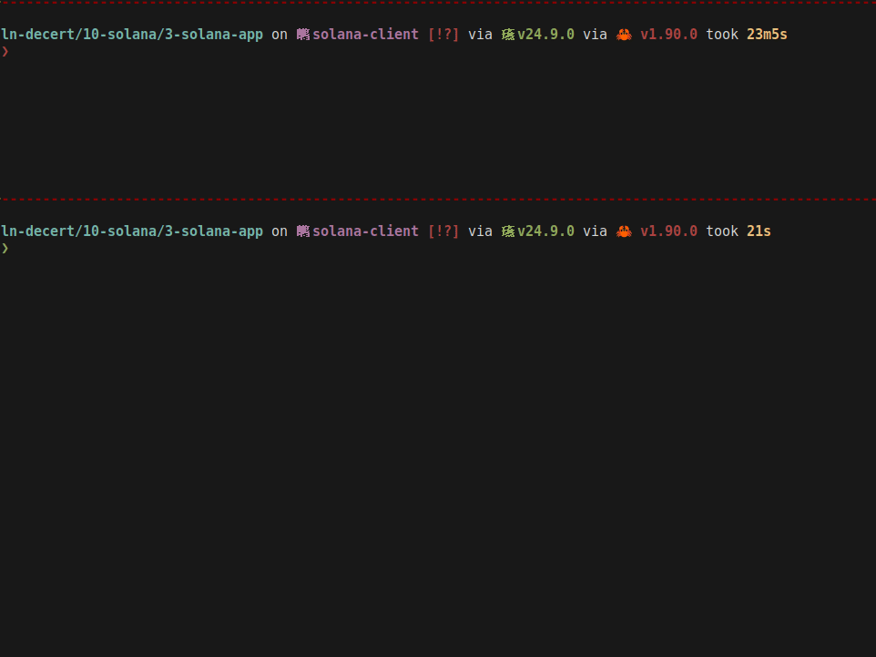

# Solana Counter App

A Solana program that implements a simple counter with increment functionality, demonstrating on-chain program development with the Anchor framework.

## Prerequisites

- [Rust](https://www.rust-lang.org/tools/install)
- [Solana CLI](https://docs.solana.com/cli/install-solana-cli-tools)
- [Anchor Framework](https://www.anchor-lang.com/docs/installation#install-anchor-cli) It's suggested to install avm and use it to manage Anchor versions.

## Installation

```bash
# Install dependencies
npm install
```

## Build

```bash
# Build the program
anchor build
```

## Test

```bash
# Run tests
anchor test
```

## Deploy

```bash
# Deploy to devnet
anchor deploy --provider.cluster devnet

# Update the program ID in lib.rs and Anchor.toml with the deployed address
```

## Usage

Call the Solana program to increment and fetch a counter value:

```bash
anchor localnet
anchor run call-counter
```



### Code Example

```typescript
// Initialize a counter
await program.methods
  .initialize()
  .accounts({
    counter: counterPda,
    user: userWallet.publicKey,
    systemProgram: SystemProgram.programId,
  })
  .rpc();

// Increment the counter
await program.methods
  .increment()
  .accounts({
    counter: counterPda,
    user: userWallet.publicKey,
  })
  .rpc();
```

## Program ID

```
AxEx7K72AZiwkxgwxw3KkEtjAc6ezdPxcYK3zFJd3Qgu
```

> **Note**: Replace this with your actual program ID after deployment

## Project Structure

```
.
├── programs/
│   └── counter-app/
│       └── src/
│           └── lib.rs          # Main program logic
├── tests/
│   └── counter-app.ts          # Integration tests
├── migrations/
│   └── deploy.ts               # Deployment script
├── Anchor.toml                 # Anchor configuration
└── package.json                # Node dependencies
```

