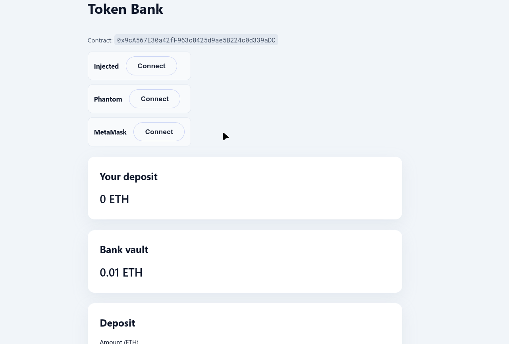

# Token Bank Project

This repo holds the Bank smart contract and the React frontend.



### Deploy TokenBank with Foundry

1. Set your RPC URL, private key, and Etherscan key as env vars:
   ```bash
   export RPC_URL="https://sepolia.infura.io/v3/YOUR_KEY"
   export PRIVATE_KEY="0xabc..."
    export ETHERSCAN_API_KEY="your-etherscan-key"
   ```
2. Build the contract:
   ```bash
   forge build
   ```
3. Deploy with `forge create`:
   ```bash
   forge create src/Bank.sol:Bank \
     --rpc-url "$RPC_URL" \
     --private-key "$PRIVATE_KEY"
   ```
4. Verify the contract on Etherscan:
   ```bash
   forge verify-contract \
     --chain-id 11155111 \
     --watch \
     DEPLOYED_ADDRESS \
     src/Bank.sol:Bank \
     --etherscan-api-key "$ETHERSCAN_API_KEY"
   ```
5. Copy the deployed address into the frontend `.env.local` file.

## Frontend

The frontend code sits in `frontend/`.

### Configure

1. Copy the env file:
   ```bash
   cd frontend
   cp .env.example .env.local
   ```
2. Fill the Bank contract address, chain id, and RPC URL in `.env.local`. The sample file points to Sepolia (chain id `11155111`, RPC `https://1rpc.io/sepolia`).

### Install deps

With npm:
```bash
npm install
```


### Run dev server
```bash
npm run dev
```
The app opens at `http://localhost:5173`.

### Build
```bash
npm run build
```
