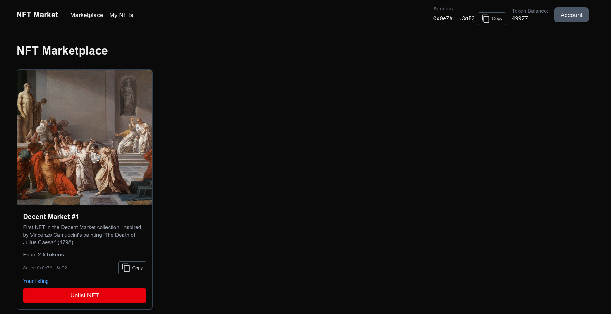

# NFT Market Fullstack Application

A complete fullstack NFT marketplace with Solidity smart contracts, backend event listener, and Next.js frontend integrated with AppKit/WalletConnect.

## Demo

[](./nft-demo.mp4)





## Project Structure

```
├── src/                    # Smart contracts (Solidity)
├── script/                 # Deployment scripts (Foundry)
├── listener/              # Backend event listener (TypeScript)
├── app/                   # Next.js frontend (React + TypeScript)
│   ├── components/        # React components
│   ├── hooks/             # Custom hooks for contract interactions
│   ├── config/            # Wagmi and contract configurations
│   └── ...                # Pages and layouts
└── ...
```

## Smart Contracts

### Deploy the Contracts

1. **Compile contracts:**
   ```bash
   forge build
   ```

2. **Set environment variables:**
   ```bash
   export RPC_URL=<https endpoint>
   ```

3. **Deploy ERC20 token:**
   ```bash
   forge script script/DeployToken.s.sol --rpc-url $RPC_URL --private-key <your_private_key> --broadcast
   # Save the printed token address
   ```

4. **Deploy NFT Market:**
   ```bash
   export TOKEN_ADDRESS=<token address from step 3>
   forge script script/DeployNFTMarket.s.sol --rpc-url $RPC_URL --private-key <your_private_key> --broadcast
   # Save the NFT Market address
   ```

5. **(Optional) Mint demo NFTs:**
   ```bash
   export MINT_TO=<wallet address>
   export TOKEN_URI_0=https://example.com/token-0.json
   export TOKEN_URI_1=https://example.com/token-1.json
   export TOKEN_URI_2=https://example.com/token-2.json
   forge script script/DeployNFTAndMint.s.sol --rpc-url $RPC_URL --private-key <your_private_key> --broadcast
   # Save the NFT contract address
   ```

## Backend Event Listener

### Setup

1. **Install dependencies:**
   ```bash
   pnpm install
   ```

2. **Configure environment:**
   ```bash
   cp .env.example .env
   # Edit .env and add:
   # - RPC_URL=your_rpc_endpoint
   # - NFT_MARKET_ADDRESS=deployed_market_address
   # - START_BLOCK=optional_start_block
   ```

3. **Run the listener:**
   ```bash
   pnpm run dev:listener        # Development mode with hot reload
   pnpm run start:listener      # Production mode
   ```

The listener outputs JSON logs for `Listed` and `Purchase` events.

## Frontend Application

### Setup

1. **Get WalletConnect Project ID:**
   - Visit [https://cloud.reown.com](https://cloud.reown.com)
   - Create a new project
   - Copy your Project ID

2. **Configure environment:**
   ```bash
   cp .env.local.example .env.local
   # Edit .env.local and add:
   # - NEXT_PUBLIC_WALLETCONNECT_PROJECT_ID=your_project_id
   # - NEXT_PUBLIC_NFT_MARKET_ADDRESS=deployed_market_address
   # - NEXT_PUBLIC_NFT_ADDRESS=deployed_nft_address
   # - NEXT_PUBLIC_TOKEN_ADDRESS=deployed_token_address
   # Note: Set NEXT_PUBLIC_MARKET_START_BLOCK to the deployment block of the marketplace to preload existing listings.
  ```

3. **Run development server:**
   ```bash
   pnpm run dev
   ```
   Open [http://localhost:3000](http://localhost:3000)

### Features

- **Wallet Connection**: Connect via WalletConnect, MetaMask, or other wallets
- **My NFTs Page**: View your NFTs, approve, and list them for sale
- **Marketplace Page**: Browse and purchase listed NFTs with tokens
- **Real-time Updates**: Listen to blockchain events for live marketplace updates

### User Flow

1. **Account A - List NFT:**
   - Connect wallet
   - Navigate to "My NFTs"
   - Approve NFT for marketplace
   - Set price and list NFT

2. **Account B - Purchase NFT:**
   - Switch/connect different account
   - Navigate to "Marketplace"
   - Approve tokens for purchase
   - Buy the NFT

## Production Deployment

### Build for Production

```bash
# Build Next.js with standalone output
pnpm run build

# The standalone build will be in .next/standalone/
```

### Deploy with Nginx

1. **Copy files to server:**
   ```bash
   # Upload .next/standalone/, .next/static/, and public/ to server
   scp -r .next/standalone/* user@server:/var/www/nft-market/
   scp -r .next/static user@server:/var/www/nft-market/.next/
   scp -r public user@server:/var/www/nft-market/
   ```

2. **Run with PM2:**
   ```bash
   cd /var/www/nft-market
   pm2 start node --name "nft-market" -- server.js
   pm2 startup
   pm2 save
   ```

3. **Configure Nginx:**
   ```nginx
   server {
       listen 80;
       server_name yourdomain.com;

       location / {
           proxy_pass http://localhost:3000;
           proxy_http_version 1.1;
           proxy_set_header Upgrade $http_upgrade;
           proxy_set_header Connection 'upgrade';
           proxy_set_header Host $host;
           proxy_cache_bypass $http_upgrade;
       }

       # Optional: Serve static files directly
       location /_next/static/ {
           alias /var/www/nft-market/.next/static/;
           expires 365d;
           access_log off;
       }
   }
   ```

4. **Enable SSL with Let's Encrypt:**
   ```bash
   sudo certbot --nginx -d yourdomain.com
   ```

## Testing Mobile WalletConnect

1. **Install a mobile wallet:**
   - MetaMask Mobile
   - Trust Wallet
   - Rainbow Wallet
   - etc.

2. **Connect to the app:**
   - Click "Connect Wallet" in the app
   - Select "WalletConnect"
   - Scan QR code with mobile wallet
   - Approve connection

3. **Test transactions:**
   - List an NFT (approve + list transaction)
   - Switch to another account
   - Purchase NFT (token approve + buy transaction)

## Example Workflow

1. Mint some NFTs using the deployment script
2. Account A connects wallet and lists NFT for 100 tokens
3. Account B connects wallet with sufficient token balance
4. Account B approves tokens and purchases the NFT
5. NFT ownership transfers to Account B
6. Tokens transfer to Account A

## Contract Addresses (Example)

- **NFT Contract**: [DecentMarketNFT](https://sepolia.etherscan.io/address/0x19889347BE8dc28b7C555F6CDb9B21bF1b01Ce29)
- **Market Contract**: [NFTMarket](https://sepolia.etherscan.io/address/0x6ace637683e010f9fb4dcccdb3c50c28294736e6)
- **Token Contract**: [DecentMarketToken](https://sepolia.etherscan.io/address/0x4Af5347243f5845cFe7a102e651e661eC1Ce7437)

## Tech Stack

- **Smart Contracts**: Solidity, Foundry, OpenZeppelin
- **Backend**: TypeScript, Viem
- **Frontend**: Next.js 15, React 19, TypeScript
- **Web3**: Wagmi, Viem, AppKit (Reown)
- **Styling**: Tailwind CSS
- **Deployment**: Standalone Next.js, Nginx, PM2
