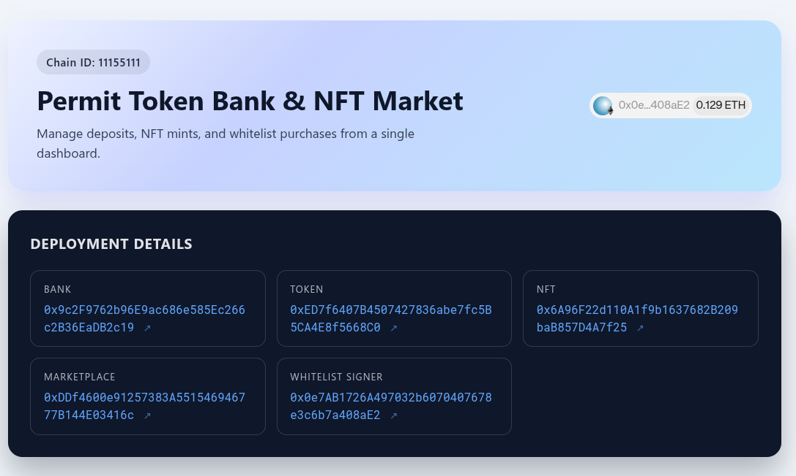
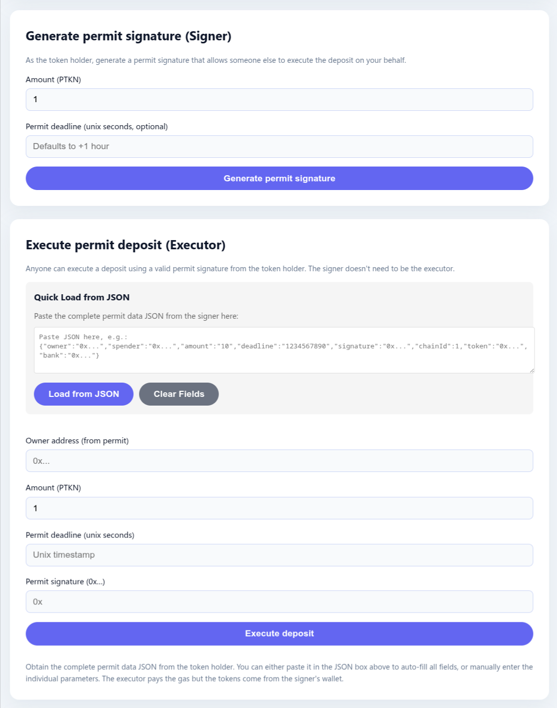
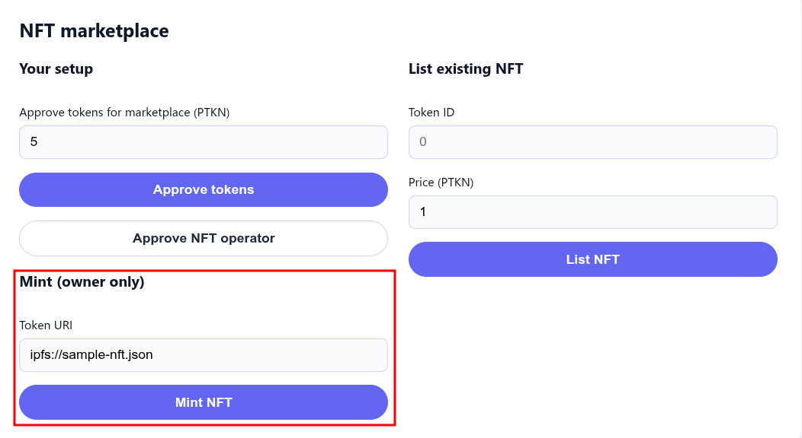
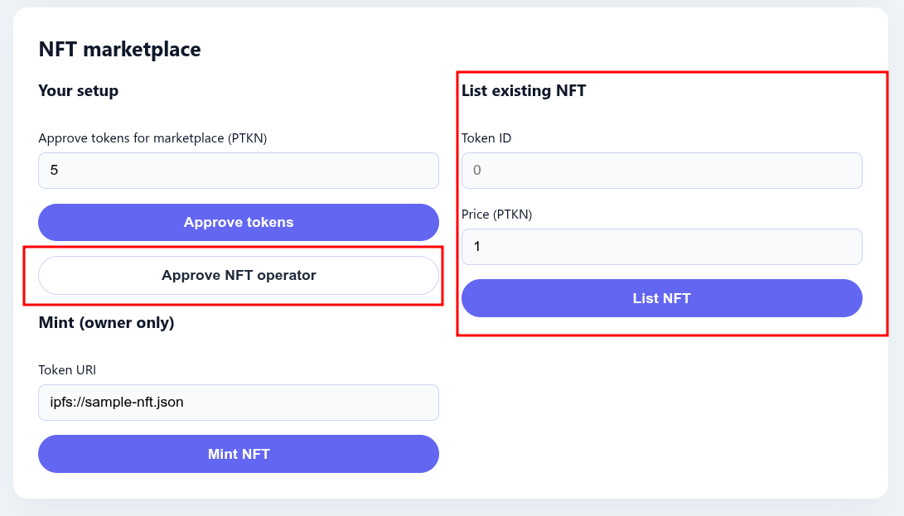
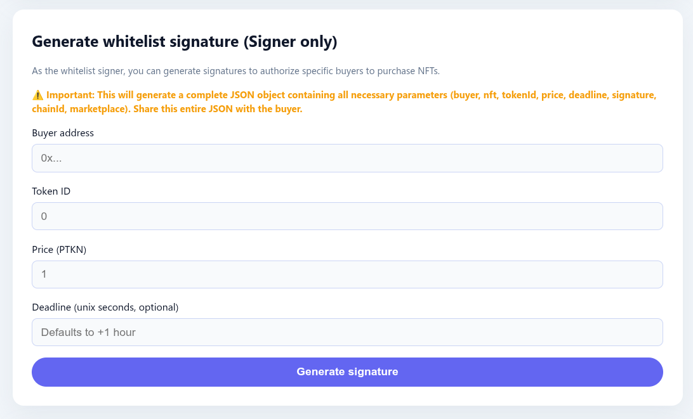
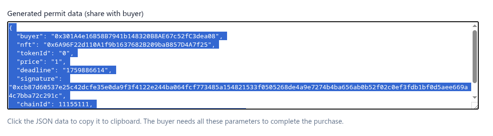
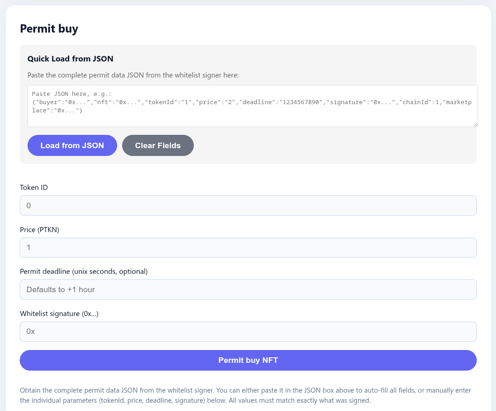

# Quickstart 

## Requirements

- [Foundry](https://getfoundry.sh/introduction/installation/)
- [Reown](https://dashboard.reown.com/) project ID
- Some Sepolia Ether to run the on-chain transactions (you can get it from a faucet, e.g., from [Google](https://cloud.google.com/application/web3/faucet/ethereum/sepolia))

Clone the project:

```bash
git clone git@github.com:cassc/ln-decert.git
cd ln-decert/5-wallet-fullstack/7-token-bank-eip712-permit 
```

## Deploy Contracts 

- Configure environment variables required for deploying the contracts. Note that WHITELIST_SIGNER, TOKEN_OWNER, and NFT_OWNER can be the same address:

```bash
export RPC_URL=wss://ethereum-sepolia-rpc.publicnode.com
export TOKEN_OWNER=0x.. # ERC20 token contract owner
export WHITELIST_SIGNER=0x.. # Whitelist signer
export NFT_OWNER="0x.." # NFT contract owner
export NFT_NAME=""                   
export NFT_SYMBOL=""                       
```


- Deploy contracts:

```bash
forge script script/DeployPermitSystem.s.sol:DeployPermitSystem \
  --rpc-url "$RPC_URL" \  # update this 
  --broadcast \
  --verify \
  --force \
  --etherscan-api-key "$ETHERSCAN_API_KEY" \ # update this 
  --account my-foundry-wallet \ # update this 
  -vvvv    
```

If the deployment is successful, the addresses of the deployed contracts will be printed in the console. You will need them when running the web app in the next step:

```bash
== Logs ==
  === Permit system deployment parameters ===
  tokenOwner 0xbfDB175c3A4AD1965d2137a18B88a63e16A38426
  nftOwner 0xbfDB175c3A4AD1965d2137a18B88a63e16A38426
  whitelistSigner 0x0e7AB1726A497032b6070407678e3c6b7a408aE2
  nftName CNFT
  nftSymbol CNFT
  === Deployed contracts ===
  PermitToken 0xED7f6407B4507427836abe7fc5B5CA4E8f5668C0
  Bank 0x9c2F9762b96E9ac686e585Ec266c2B36EaDB2c19
  PermitNFT 0x6A96F22d110A1f9b1637682B209baB857D4A7f25
  NFTMarket 0xDDf4600e91257383A551546946777B144E03416c
```

## Start the Frontend

- Configure the frontend `.env.local`:

```bash
cd frontend
cp .env.example .env.local
```

Edit the `.env.local` settings.

- Start the frontend app:
```bash
pnpm i
pnpm run dev
```

## Frontend Usage

The deployment details, which contain the addresses, owners, and signers, are shown at the top:

 


### Bank Related Operations
- ERC20 token owners can generate permits off-chain
- and execute permitDeposit on-chain by the user or someone else




### NFT Market Operations
- The owner of the NFT contract can mint NFTs:

- The owner of an NFT can list the NFT on the market. Note that the user must approve the market to spend the NFT first:


### Signing the Permit to Purchase an NFT
- Connect the signer for the whitelist sale to the web app. You will see the form to sign the NFT sale permit off-chain here:


After signing the data, the signature along with sale parameters can be copied as a single JSON text, e.g.:



### Whitelist Buyer Purchases the NFT

> Transfer some ERC20 tokens from the owner to the whitelisted buyers, as they will need them to complete the purchase.

- Connect a buyer from the whitelist sale to the web app. Use the following form to buy the NFT:

