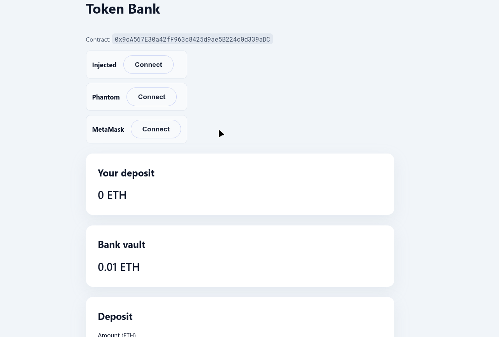

# Token Bank + Permit2

This project contains the Token Bank smart contracts and the React frontend that lets users deposit ERC20 tokens with either a normal allowance or a Permit2 signature. Users approve Permit2 once, sign an off-chain permit, and the Bank contract calls Permit2 to pull tokens from the wallet.



## Contracts

- `src/PermitToken.sol` – simple ERC20 with owner minting, used for local demos.
- `src/Bank.sol` – stores user balances, supports classic `deposit`, `withdraw`, and the new `depositWithPermit2`.
- `lib/permit2` – Uniswap’s Permit2 implementation (pulled in as a git dependency).

### Local deployment flow

1. Export your RPC URL and key:
   ```bash
   export RPC_URL="https://sepolia.infura.io/v3/YOUR_KEY"
   export PRIVATE_KEY="0xabc..."
   ```
2. Deploy the demo token (or point to any ERC20):
   ```bash
   forge create src/PermitToken.sol:PermitToken \
     --rpc-url "$RPC_URL" \
     --private-key "$PRIVATE_KEY" \
     --constructor-args 0xYourOwnerAddress
   ```
3. Deploy Permit2 if you are not using the canonical Uniswap address (`0x000000000022d473030f116ddee9f6b43ac78ba3`):
   ```bash
   forge create lib/permit2/src/Permit2.sol:Permit2 \
     --rpc-url "$RPC_URL" \
     --private-key "$PRIVATE_KEY"
   ```
4. Deploy the Bank contract with your token and Permit2 addresses:
   ```bash
   forge create src/Bank.sol:Bank \
     --rpc-url "$RPC_URL" \
     --private-key "$PRIVATE_KEY" \
     --constructor-args 0xTokenAddress 0xPermit2Address
   ```
5. Run the tests anytime with:
   ```bash
   forge test
   ```

## Frontend

The frontend inside `frontend/` reads wallet balances, shows allowances, and walks the user through both deposit paths.

### Configure

1. Copy the sample env file and fill the addresses:
   ```bash
   cd frontend
   cp .env.example .env.local
   ```
   Required fields:
   - `VITE_BANK_ADDRESS`
   - `VITE_TOKEN_ADDRESS`
   - `VITE_PERMIT2_ADDRESS` (defaults to the Uniswap deployment if omitted)
   - `VITE_CHAIN_ID`, `VITE_CHAIN_NAME`, `VITE_RPC_URL`
2. Install deps and start the dev server:
   ```bash
   npm install
   npm run dev
   ```
   The app lives at `http://localhost:5173`.

### Build / lint

```bash
npm run build
npm run lint
```

## Deposit UX summary

1. Approve the Bank contract once for classic deposits.
2. Approve the Permit2 contract once for signature-based deposits.
3. Use “Direct deposit” to spend the ERC20 allowance.
4. Use “Permit2 deposit” to sign an EIP-712 message and let the Bank pull tokens through Permit2 in the same transaction.
