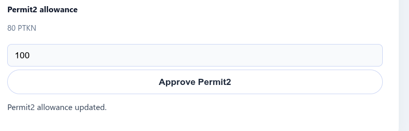
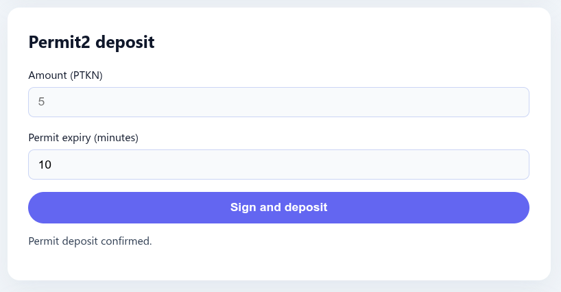

# Token Bank Frontend (Permit2)

The UI lets users deposit an ERC20 into the Bank contract in two ways:

1. **Direct deposit** – uses a standard ERC20 allowance towards the Bank contract.
2. **Permit2 deposit** – the wallet signs an off-chain permit and the Bank contract calls Uniswap’s Permit2 to pull the tokens in the same on-chain call.

## Setup

1. Copy the env file:
   ```bash
   cp .env.example .env.local
   ```
2. Fill in:
   - `VITE_BANK_ADDRESS`
   - `VITE_TOKEN_ADDRESS`
   - `VITE_PERMIT2_ADDRESS` (use Uniswap’s canonical address or your local deployment)
   - Chain id, chain name, and RPC URL
3. Install deps and start the dev server (pnpm):
   ```bash
   pnpm install
   pnpm dev
   ```
   The app opens on `http://localhost:5173`.

## Usage

- Connect your wallet and make sure the dApp is on the same chain as the contracts.
- **Allowances** section: approve the Bank (for direct deposits) and approve Permit2 (needed once per wallet).



- **Direct deposit**: enter an amount and submit once the Bank allowance covers that amount.
- **Permit2 deposit**: enter an amount plus a permit expiry (minutes). The wallet signs the EIP‑712 permit, then the UI calls `depositWithPermit2`.




- **Withdraw**: sends your full balance back to the wallet.
- Status messages under each section tell you what is happening (signing, waiting for confirmation, done, or errors).

## Notes

- The UI uses `wagmi` + `viem` for wallet and typed-data signing.
- All values are shown with the token decimals as reported by the ERC20 contract.
- Update `.env.local` whenever you deploy a new Bank, token, or Permit2 contract.
