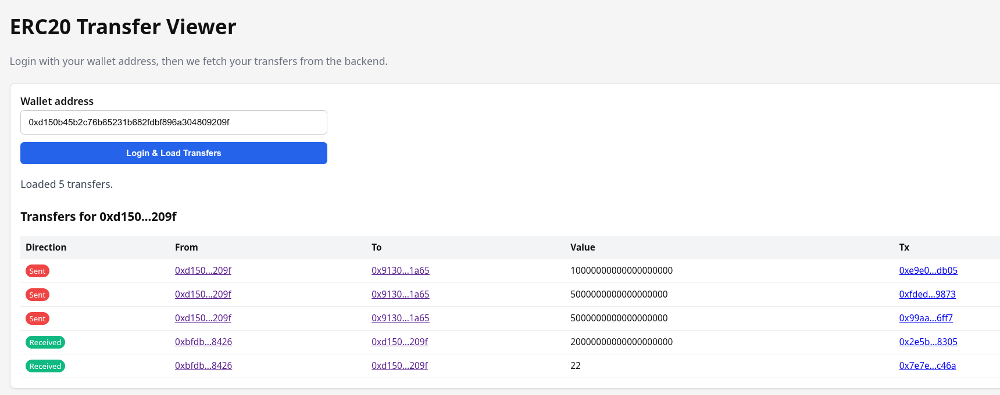

# ERC20 transfer indexer

This app uses Viem to index ERC20 `Transfer` logs into SQLite, exposes them through a REST API, and serves a simple web UI.

## Setup
- Copy `.env.example` to `.env` and fill in your RPC URL, token address, and start block.
- Install packages: `pnpm install`.
- Start the app: `pnpm dev` (or `pnpm start` for production). Open `http://localhost:3000/` to use the frontend; the backend API runs on the same port.
- Public/free RPC nodes often reject wide `eth_getLogs` ranges. If you hit range-limit errors, lower `BLOCK_BATCH_SIZE` or use a paid RPC key.

## API
- `GET /health` simple health check.
- `GET /transfers/:address?limit=100&offset=0` returns transfers where the address is sender or receiver. `limit` max is 500.

The indexer polls the chain every `POLL_INTERVAL_MS` milliseconds and stores data in the file from `DB_PATH`. The frontend calls `/transfers/:address` to show the user’s transfers and links out to Etherscan for addresses and tx hashes.
