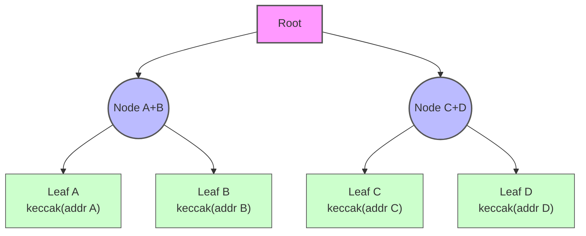
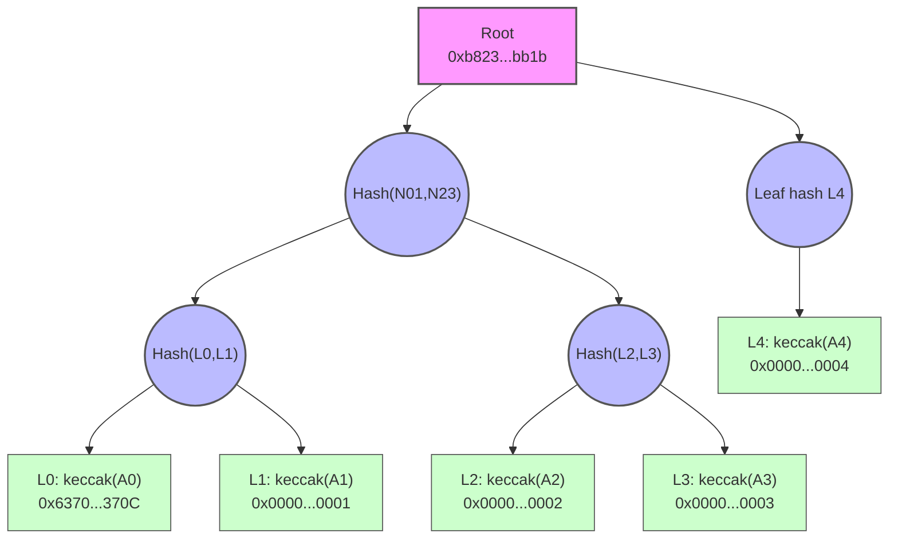

# AirdopMerkleNFTMarket

This Foundry workspace demonstrates how to gate an NFT primary/secondary sale behind a Merkle-tree whitelist while letting buyers condense approval + purchase into a single `multicall` transaction. Everything—ERC20 payment token, ERC721 collection, and marketplace—is authored by the same developer, so assumptions around minting and approvals hold during tests.

## Contracts

- `SaleToken` – ERC20 + ERC20Permit token the buyer spends. The owner (deployer) can mint test balances.
- `WhitelistNFT` – Simple ERC721 whose tokens are escrowed inside the market while listed.
- `AirdopMerkleNFTMarket`
  - Sellers `list(tokenId, price)` by transferring their NFT into escrow.
  - Whitelisted buyers receive a **50% discount** and must call the market through `multicall([permitPrePay(), claimNFT()])`.
  - `permitPrePay` calls the token’s `permit` so no ERC20 approval transaction is required.
- `claimNFT` verifies the Merkle proof (`leaf = keccak256(abi.encodePacked(buyer))`), charges the discounted amount via SafeERC20, and transfers the NFT out of escrow.
- Anyone can aggregate helper calls with `multicall` (delegatecall style) to minimize transactions.

### Why `multicall`?

The buyer still submits the transaction, but `multicall` bundles `permitPrePay` + `claimNFT` so the ERC20 permit signature is consumed and the NFT is claimed in **one** on-chain call. Benefits:

- Removes the need for a prior `approve` transaction; the permit is signed off-chain and consumed inside the bundled call.
- Guarantees atomicity: if whitelist verification fails, neither the permit allowance nor the NFT transfer succeeds.
- Simplifies UX for wallets/dapps, which only have to prepare a single calldata payload for their users.

## Whitelist / Merkle Tree

- The owner seeds the contract with `merkleRoot` via the constructor or `setMerkleRoot`.
- Leaves are `keccak256(abi.encodePacked(userAddress))`.
- Proofs can be generated with any Merkle-tree tool (e.g., scripts using `merkletreejs` under pnpm). Just keep the pair hashing commutative (`hash(sortedPair)`), matching OpenZeppelin’s `MerkleProof`.
- Address ordering matters: every participant must share the same ordered whitelist to derive identical roots/proofs.



To prove inclusion of leaf C, the buyer supplies the hashes from leaf D and Node A+B. The contract recomputes the highlighted path and checks it equals the stored root.

## Typical Buyer Flow

1. Seller lists an NFT (already handled in setup/tests by approving the market and calling `list`).
2. Buyer receives a Merkle proof off-chain.
3. Buyer signs an ERC20 permit message authorizing the market to spend up to the discounted price.
4. Buyer executes:
```solidity
bytes[] memory calls = new bytes[](2);
calls[0] = abi.encodeWithSelector(market.permitPrePay.selector, value, deadline, v, r, s);
calls[1] = abi.encodeWithSelector(market.claimNFT.selector, tokenId, proof);
market.multicall(calls);
```
This single call performs the approval and purchase atomically.

## Development

### Install

```shell
forge install
```

### Build

```shell
forge build
```

### Test

```shell
forge test
```

The suite (`test/AirdopMerkleNFTMarket.t.sol`) covers:

- Successful discounted purchase with `multicall([permitPrePay, claimNFT])`.
- Reversion for non-whitelisted buyers even when they submit a permit signature.
- A CLI-proof scenario generated via `pnpm proof`, demonstrating deterministic proofs in tests.

### Generate Merkle Proofs

`scripts/generate-proof.mjs` builds whitelist trees that mirror the on-chain hashing (`keccak256(abi.encodePacked(addr))`). Run it through pnpm:

```shell
# From JSON
pnpm proof --file allowlist.json --target 0x1234...

# Inline list (order matters!)
pnpm proof \
  --addresses 0x1111...,0x2222...,0x3333...,0x4444...,0x5555... \
  --target 0x2222...
```

Arguments:

- `--file path/to/addresses.json` – JSON array of addresses.
- `--addresses addr1,addr2,...` – comma-separated list.
- `--target 0x...` – address to generate a proof for.
- `--pretty=false` – optional compact JSON output.

The script:

1. Normalizes and deduplicates addresses while preserving order (everyone must share the same ordered list to reproduce the root).
2. Requires at least four unique addresses, ensuring the tree has >2 layers.
3. Prints `merkleRoot`, `proof[]`, `target`, `targetIndex`, `depth`, and the ordered `addresses`. Feed the root into `setMerkleRoot` and pass the proof to `claimNFT`.

### Example: values used in the Foundry test

The CLI test case (`testCliProofAllowsClaim`) was generated by running:

```shell
pnpm proof \
  --addresses 0x6370eF2f4Db3611D657b90667De398a2Cc2a370C,0x0000000000000000000000000000000000000001,0x0000000000000000000000000000000000000002,0x0000000000000000000000000000000000000003,0x0000000000000000000000000000000000000004 \
  --target 0x6370eF2f4Db3611D657b90667De398a2Cc2a370C
```



Because there are five leaves, the last hash `L4` is simply promoted up each layer without being duplicated (MerkleTreeJS default when `duplicateOdd` is not set). If you enable `duplicateOdd: true`, the root/proof values will change.

Which produced (trimmed):

```json
{
  "merkleRoot": "0xb823d514814fcd8a34f3f96caf512598eb7b7a22308db39003c9d0e004bfbb1b",
  "proof": [
    "0x1468288056310c82aa4c01a7e12a10f8111a0560e72b700555479031b86c357d",
    "0x32ce85405983c392122c7c4869690b8081fc9ecec74276206caea196c6e545cb",
    "0xa876da518a393dbd067dc72abfa08d475ed6447fca96d92ec3f9e7eba503ca61"
  ],
  "target": "0x6370eF2f4Db3611D657b90667De398a2Cc2a370C",
  "targetIndex": 0,
  "depth": 4,
  "addresses": [
    "0x6370eF2f4Db3611D657b90667De398a2Cc2a370C",
    "0x0000000000000000000000000000000000000001",
    "0x0000000000000000000000000000000000000002",
    "0x0000000000000000000000000000000000000003",
    "0x0000000000000000000000000000000000000004"
  ]
}
```

Those root/proof constants are copied directly into the test, and the CLI buyer uses the private key `0x0102030405060708090a0b0c0d0e0f101112131415161718191a1b1c1d1e1f20` (address `0x6370...370C`) so its permit signature is reproducible.

### Sign Permit Payloads

`scripts/sign-permit.mjs` prepares EIP-2612 signatures so you can bundle approvals inside `multicall` without deploying extra tooling. **Use throwaway keys only**—this script emits signatures derived from the supplied private key.

```shell
pnpm permit \
  --private-key 0x0102030405060708090a0b0c0d0e0f101112131415161718191a1b1c1d1e1f20 \
  --token 0xSaleTokenAddress \
  --spender 0xMarketAddress \
  --value 5000000000000000000 \
  --deadline 2000000000 \
  --chain-id 31337 \
  --nonce 0 \
  --name "Whitelist Purchase Token" \
  --version 1
```

Helpful flags:

- `--rpc <url>` – optional JSON-RPC endpoint to auto-fetch `nonces(owner)`, `name()`, and `version()`.
- `--nonce`, `--name`, `--version` – manual overrides (perfect for local Foundry tests). Without `--rpc`, nonce defaults to `0`.
- `--value`, `--deadline` – integers expressed in wei / Unix seconds.

Sample output:

```json
{
  "domain": { "name": "Whitelist Purchase Token", "version": "1", "chainId": 31337, "verifyingContract": "0x..." },
  "message": { "owner": "0x6370...370C", "spender": "0xMarket...", "value": "5000000000000000000", "nonce": "0", "deadline": "2000000000" },
  "signature": { "v": 28, "r": "0x...", "s": "0x..." }
}
```

Paste `(v,r,s)` along with the same parameters into `permitPrePay` before calling `claimNFT` within `multicall`.

### Format

```shell
forge fmt
```

## Notes

- Because `multicall` relies on `delegatecall`, it bubbles up exact revert reasons to help with debugging.
- When adjusting whitelist members, remember to recompute the Merkle root and update the contract before distributing proofs.
