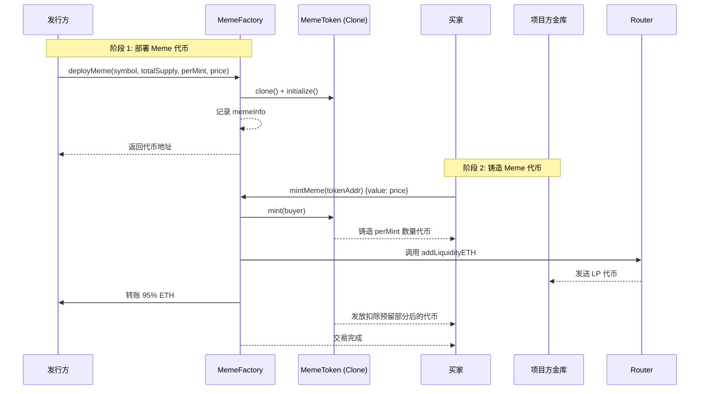

# Meme 代币工厂

本项目基于 OpenZeppelin 提供的 `Clones` 库，实现 EIP-1167 最小代理模式，让发行方快速部署 Meme ERC20 代币。项目基于 Foundry，核心模块如下：

- `MemeFactory`：部署代理实例、记录代币配置，并在铸造时抽取 5% 的费用来添加流动性，同时将 95% ETH 返还给发行方。
- `MemeToken`：可初始化的 ERC20 代币，限制单次铸造数量并校验总量上限。

## 功能概览
- `deployMeme(symbol, totalSupply, perMint, price)`：发行方部署新的 Meme 代币实例。
- `mintMeme(tokenAddr)`：买家支付 `price` 后获得固定数量 `perMint` 的代币，工厂会将 5% 的费用和预留代币一起注入 Uniswap V2 流动性池。
- `buyMeme(tokenAddr)`：当 Uniswap 价格优于铸造起始价格时，买家可直接通过工厂调用路由器购买代币。
- 流动性 LP 头寸默认发给项目方金库地址，便于后续管理。

## 使用流程
1. 发行方准备代币参数：符号 `symbol`、可铸总量 `totalSupply`、单次铸造数量 `perMint`、单次铸造价格 `price`。
2. 发行方调用 `deployMeme`，工厂合约会克隆一个 `MemeToken` 实例并记录配置。
3. 买家调用 `mintMeme` 并支付指定价格。工厂会铸造代币并暂存其中一部分，同时将 5% 的 ETH 和这部分代币添加到 Uniswap V2 流动性池，LP 代币发送给金库。剩余 95% 的 ETH 返还给发行方，买家获得剩余的代币。
4. 如果市场价格突破初始定价，买家还可以调用 `buyMeme` 按 Uniswap 实时价格购入。

### 流程图示



## 参数说明
- `symbol`：代币符号，字符串不能为空。
- `totalSupply`：最大可铸数量，必须大于 0。
- `perMint`：每次铸造的固定数量，需小于等于 `totalSupply`。
- `price`：每次铸造需要支付的 ETH 数量。

## 快速开始
1. 安装依赖（已包含 `forge-std` 与 `openzeppelin-contracts` 子模块）。
2. 编译合约：
   ```bash
   forge build
   ```
3. 运行测试：
   ```bash
   forge test
   ```

## 测试说明
`test/MemeFactory.t.sol` 覆盖以下场景：
- 部署后的代币代号、发行方与配置参数是否正确。
- 买家铸造后代币数量、总计铸造量以及费用分配是否正确。
- 当铸造会超过 `totalSupply` 时会正确回退。

## OpenZeppelin 与 EIP-1167
- 复用 OpenZeppelin 官方库可获得经过审计的最小代理实现，减少自写汇编带来的风险。
- 以下代码片段来自 `openzeppelin-contracts/contracts/proxy/Clones.sol`:

```solidity
// SPDX-License-Identifier: MIT
library Clones {
    function clone(address implementation, uint256 value) internal returns (address instance) {
        assembly ("memory-safe") {
            // 1. mstore：先把实现地址左移 0x60，再右移 0xe8 取出高 3 字节，填进模板中 PUSH20 的前 3 字节占位，写入内存 0x00。
            mstore(0x00, or(shr(0xe8, shl(0x60, implementation)), 0x3d602d80600a3d3981f3363d3d373d3d3d363d73000000))
            // 2. mstore：把剩余 17 字节的实现地址移到高位，和模板尾部 0x5af4...5bf3 组合，写入内存 0x20。
            mstore(0x20, or(shl(0x78, implementation), 0x5af43d82803e903d91602b57fd5bf3))
            // create：从内存偏移 0x09 读取 0x37 字节初始化代码调用 CREATE，并把新地址写入 instance。
            instance := create(value, 0x09, 0x37)
        }
        if (instance == address(0)) {
            // CREATE 返回零地址表示部署失败，回退并抛出 FailedDeployment。
            revert Errors.FailedDeployment();
        }
    }
}
```

补充说明：
- `assembly ("memory-safe")` 告诉编译器我们遵守内存安全约定，避免额外检查。
- 第一个 `mstore` 把实现地址的前 3 字节填入模板 `...73 000000` 的占位区。
- 第二个 `mstore` 将剩余 17 字节移到高位，与常量 `0x5af4...5bf3` 拼成完整 runtime 代码。
- `create(value, 0x09, 0x37)` 表示从内存偏移 `0x09` 取 `0x37` 字节喂给 `CREATE`，并附带 `value` ETH。
- CREATE 返回零地址则意味着部署失败，抛出 `FailedDeployment` 终止执行。
