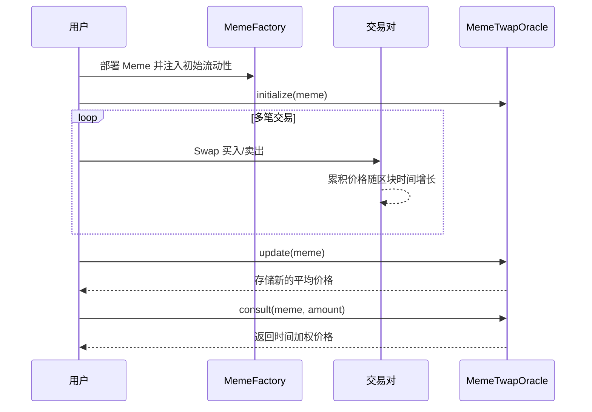

# Meme 代币工厂（含 TWAP 预言机）

本仓库演示如何通过 LaunchPad 快速发行 Meme ERC20 代币，并提供一个基于 Uniswap V2 交易对的 TWAP（时间加权平均价格）预言机合约。

## 合约模块
- `MemeFactory`：使用 EIP-1167 最小代理模式克隆 MemeToken，按固定价格出售代币，并抽取 5% 的 ETH 和代币加入流动性池。
- `MemeToken`：可初始化的 ERC20 代币，限制单次铸造额度和总量上限。
- `MemeTwapOracle`：记录交易对累积价格，按指定周期计算 Meme/WETH 的时间加权平均价格。

## TWAP 工作流程
1. 通过工厂部署 Meme 代币并向交易对注入初始 Meme/WETH 流动性。
2. 调用 `MemeTwapOracle.initialize` 绑定交易对并缓存当前累积价格。
3. 期间可进行多笔买入/卖出交易，累积价格随区块时间增长。
4. 等待设定的统计周期后，调用 `update` 计算新的平均价格（Q112 精度）。
5. 通过 `consult` 查询任意 Meme 数量对应的平均价格。



## 测试
执行 `forge test` 可以运行两个测试文件：
- `test/MemeFactory.t.sol`：验证工厂部署、铸造与价格保护逻辑。
- `test/MemeTwapOracle.t.sol`：模拟不同时间的多次交易，校验 TWAP 结果以及更新/查询时的回退条件。

### 关键测试用例

#### 溢出边缘情况测试
为了验证 `unchecked` 块的必要性，我们添加了专门的溢出测试：

- **`testCumulativePriceOverflow()`**：模拟 Pair 的累积价格接近 `uint256` 最大值的情况，验证 oracle 仍能正常更新和查询价格。如果没有使用 `unchecked {}`，此测试会 revert。

- **`testCumulativePriceCompleteOverflow()`**：测试累积价格完全溢出回绕到小值时，TWAP 差值计算仍然正确。这证明了模运算的正确性。

这些测试至关重要，因为它们验证了一个在生产环境中可能需要数年才会触发的边缘情况。没有这些测试，溢出问题可能在代码审查和常规测试中完全被忽视。

## 快速开始
```bash
forge install --no-git
forge test
```

## 累积价格溢出安全性分析

- **储备量上限**：Uniswap V2 交易对将储备量存储为 `uint112`，最大值为 `2^112 - 1`。
- **价格格式**：每次更新累积价格时计算 `(reserveOther << 112) / reserveSelf`。

  ```solidity
  // Uniswap V2 源码中的核心片段
  price0CumulativeLast += uint256(UQ112x112.encode(reserve1).uqdiv(reserve0)) * timeElapsed;
  ```

  说明：`UQ112x112.encode(x)` 将 `x` 左移 112 位，生成具有 112 位小数部分的固定点数；`.uqdiv(y)` 将该固定点数除以整数 `y`，保持 Q112 精度。最终得到 `reserve1 / reserve0` 的 Q112 表示。

  由于 `reserveOther <= 2^112 - 1` 且左移 112 位后仍在 224 位范围内，因此结果不会超过 `2^224`。
- **时间差范围**：`timeElapsed` 为 `uint32` 类型，最大值为 `2^32 - 1` 秒。将 `~2^224` 的价格乘以 `~2^32` 的时间差，单次增量不会超过 `2^256 - 1`，在 `uint256` 的安全范围内。
- **累积值可以溢出**：需要注意的是，虽然单次增量安全，但 `price0Cumulative` 经过长时间累积后**可能会溢出**。这是 Uniswap V2 的**有意设计**：TWAP 只使用累积价格的**差值**（`priceCumulative - priceCumulativeLast`），而 `uint256` 的模运算特性确保即使发生溢出回绕，差值计算仍然正确。例如，如果旧值为 `2^256 - 1000`，新值溢出回绕到 `500`，减法 `500 - (2^256 - 1000)` 在 `uint256` 运算下仍能得到正确的增量 `1500`。

  **⚠️ Solidity 版本关键警告**：此溢出技巧**仅在允许溢出回绕的环境下有效**！这是一个容易被忽视的陷阱，因为溢出可能在部署数年后才发生，导致合约突然失败。

  **文档状态**：[Uniswap V2 官方文档](https://docs.uniswap.org/contracts/v2/guides/smart-contract-integration/building-an-oracle)明确说明溢出是有意设计，但该文档写于 2020 年（Solidity 0.6 时代），**未更新关于 Solidity 0.8+ 的兼容性警告**。社区资源（如 [RareSkills](https://rareskills.io/post/twap-uniswap-v2)）有详细说明需要使用 `unchecked` 块，但很多开发者可能只读官方文档而遗漏这一关键细节。
  - **Uniswap V2 原始代码**：使用 Solidity 0.6.6（无自动溢出检查，默认回绕）
  - **Solidity 0.8+**：`+=` 操作会在溢出时自动 revert，**必须使用 `unchecked {}` 包裹累积价格更新代码**
  - **本合约的情况**：我们的 `MemeTwapOracle` 虽然不自己维护累积价格的存储，但在 `_currentCumulativePrices` 函数中，我们读取 Pair 的 `price0CumulativeLast`（可能已接近 uint256 max）并在内存中添加增量。这个 `+=` 操作**同样会在 Solidity 0.8+ 溢出时 revert**！因此我们使用 `unchecked {}` 包裹了这些加法操作（见 `src/MemeTwapOracle.sol:396-400`），确保即使 Pair 的累积价格已经很大，我们的 oracle 仍能正常工作。


- **流动性为零时的处理**：在 `initialize` 阶段检查储备量为非零。

  ```solidity
  (uint112 reserve0, uint112 reserve1, ) = pair.getReserves();
  if (reserve0 == 0 || reserve1 == 0) revert NoLiquidity(pair);
  ```

  如果 LP 撤出导致某个储备清零，Uniswap 会在更早阶段拒绝此类操作。并且工厂合约会永久锁定 `MINIMUM_LIQUIDITY = 1_000` 单位在池中，确保储备量不会降至 0，因此不会出现除零错误。
- **结论**：即使在代币价格几乎归零的极端情况下（如 `AIR/WETH`），累积价格仍保持在安全范围内，TWAP 计算不会发生溢出。

## 备注
- 所有合约均使用 Solidity 0.8.20。
- TWAP 计算不依赖外部库，便于阅读与审计，同时可兼容真实的 Uniswap V2 Pair。
- **自定义错误（Custom Errors）**：合约使用自定义错误而非 `require` 语句。这是 Solidity 0.8.4+ 引入的最佳实践，可节省约 25% 的部署成本。技术原理：自定义错误仅在字节码中保存 4 字节的函数选择器（selector），参数存储在 ABI 元组中，避免存储完整的错误消息字符串。此外还支持传递动态参数便于调试（如 `error PeriodNotElapsed(uint32 timeElapsed)`），并提供类型安全的错误处理。OpenZeppelin、Uniswap V3、Aave V3 等主流项目均已采用此标准。
- **累积价格不会溢出**：Uniswap V2 以 `uint112` 存储储备量，价格计算公式为 `(reserveOther * Q112) / reserveSelf`，结果最大约为 2²²⁴。再乘以 `timeElapsed (uint32)` 也不会超过 2²⁵⁶。Uniswap 合约本身的累积价格更新采用相同逻辑，因此我们的预言机复用相同的安全范围，无需担心极端汇率导致溢出。初始化阶段会校验储备量为非零，避免除零风险。
- **Q112 精度运算**：合约使用乘法 `value * Q112` 而非位移 `value << 112`。虽然两者数学等价且位移稍省 gas，但 Solidity 0.8+ 的乘法运算符有内置溢出检查会自动 revert，而位移操作会静默回绕（wrap around）。使用乘法是防御性编程的最佳实践，即使理论上不会溢出，仍能在极端情况下提供额外保护。
- **unchecked 块的使用**：在 `_currentCumulativePrices` 函数中，累积价格的加法操作被包裹在 `unchecked {}` 块内。这是因为我们从 Uniswap V2 Pair（Solidity 0.6.6 编译）读取的累积价格可能已接近 `uint256` 最大值，继续累加会溢出。使用 `unchecked` 允许溢出回绕，这是 TWAP 设计的必要组成部分。**如果不使用 unchecked，合约会在数年后突然失败**。参见 `src/MemeTwapOracle.sol:396-400`。
