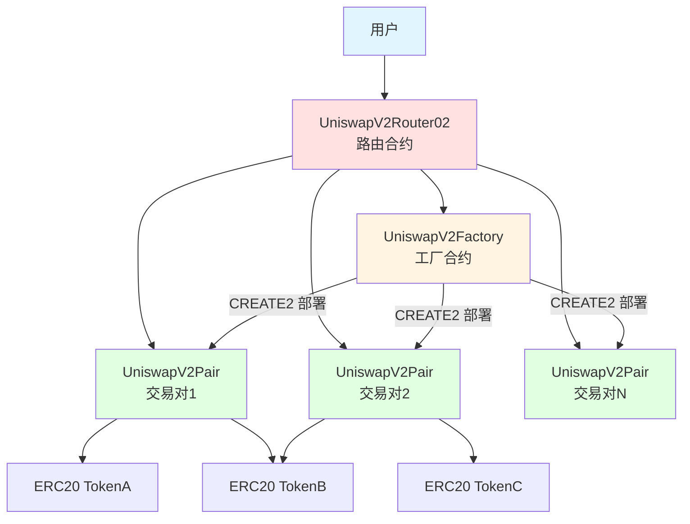
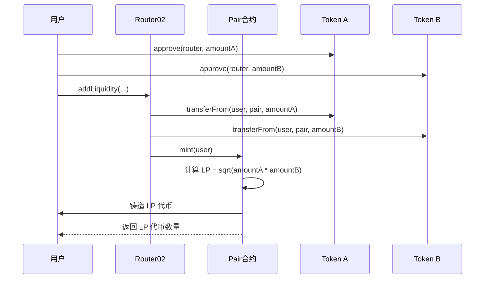
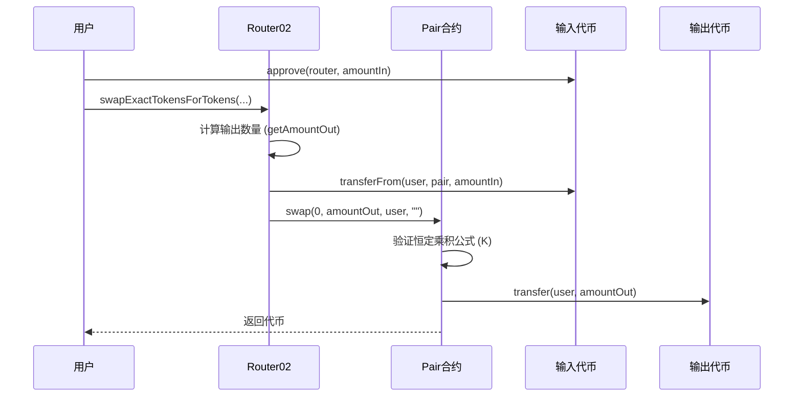
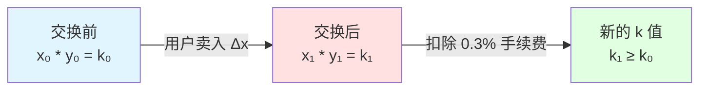

# Uniswap V2 本地部署项目

这是一个用于学习和本地部署 Uniswap V2 的 Foundry 项目，包含完整的核心和周边合约，并添加了详细的中文注释。


## 🏗️ 架构图

### Uniswap V2 整体架构



### 添加流动性流程



### 代币交换流程



### 恒定乘积公式 (x * y = k)



## 📁 项目结构

```
uniswap-v2-deploy/
├── src/
│   ├── core/                   # Uniswap V2 核心合约
│   │   ├── UniswapV2Factory.sol    # 工厂合约 - 创建交易对
│   │   ├── UniswapV2Pair.sol       # 交易对合约 - AMM 核心逻辑
│   │   ├── UniswapV2ERC20.sol      # LP 代币实现
│   │   ├── interfaces/             # 接口文件
│   │   └── libraries/              # 工具库（Math, SafeMath, UQ112x112）
│   │
│   ├── periphery/              # Uniswap V2 周边合约
│   │   ├── UniswapV2Router02.sol   # 路由合约 - 用户交互入口
│   │   ├── interfaces/             # 接口文件
│   │   └── libraries/              # 工具库（UniswapV2Library, SafeMath, TransferHelper）
│   │
│   └── test-tokens/            # 测试代币
│       ├── WETH9.sol              # Wrapped Ether
│       └── MockERC20.sol          # 通用 ERC20 测试代币
│
├── script/                     # 部署脚本
│   ├── Deploy.s.sol               # 完整部署脚本
│   └── CalculateInitCodeHash.s.sol # 计算 init_code_hash 工具
│
├── test/                       # 测试文件
│   └── UniswapV2.t.sol            # 完整功能测试
│
└── foundry.toml                # Foundry 配置
```

## 🎯 核心概念

### 1. 恒定乘积做市商 (Constant Product AMM)

Uniswap V2 使用恒定乘积公式：**x * y = k**

- `x`: token0 的储备量
- `y`: token1 的储备量
- `k`: 常数（扣除手续费后只增不减）

每次交换后，扣除手续费的乘积保持不变。

### 2. 流动性提供者 (LP)

- 用户向池中添加两种代币，获得 LP 代币
- LP 代币代表用户在池中的份额
- 移除流动性时，按比例取回代币 + 累积的手续费

### 3. 交易手续费

- 每笔交易收取 **0.3%** 手续费
- 手续费全部给 LP（如果协议手续费开启，会抽取 1/6）

### 4. 价格预言机

- 使用累积价格机制实现 TWAP (Time-Weighted Average Price)
- 防止闪电贷价格操纵

## ⚠️ 重要：init_code_hash 问题

### 什么是 init_code_hash？

`init_code_hash` 是 `UniswapV2Pair` 合约字节码的 keccak256 哈希值。它在 `UniswapV2Library.sol` 的 `pairFor()` 函数中使用，用于链下计算交易对地址。

### 为什么需要更新它？

使用 CREATE2 部署时，交易对地址通过以下公式计算：

```solidity
address(uint160(uint256(keccak256(abi.encodePacked(
    byte(0xff),
    factory,
    keccak256(abi.encodePacked(token0, token1)),
    initCodeHash  // <- 这里！
)))))
```

**如果 init_code_hash 不正确，Router 将无法找到正确的交易对地址！**

### 如何获取正确的 init_code_hash？

由于项目使用多个 Solidity 版本，存在编译问题。使用 Foundry 脚本或直接调用：
   ```solidity
   bytes32 hash = keccak256(type(UniswapV2Pair).creationCode);
   ```

### 更新 init_code_hash

获取正确的 hash 后，更新 `src/periphery/libraries/UniswapV2Library.sol` 的第 **43** 行：

```solidity
function pairFor(address factory, address tokenA, address tokenB) internal pure returns (address pair) {
    (address token0, address token1) = sortTokens(tokenA, tokenB);
    pair = address(uint(keccak256(abi.encodePacked(
            hex'ff',
            factory,
            keccak256(abi.encodePacked(token0, token1)),
            hex'<YOUR_INIT_CODE_HASH_HERE>'  // <- 替换这里！
        ))));
}
```

## 🚀 部署流程

### 前置要求

```bash
# 安装 Foundry
curl -L https://foundry.paradigm.xyz | bash
foundryup

# 验证安装
forge --version
```

### 编译合约


```bash
forge build 
```

### 本地部署

1. 启动本地节点：
   ```bash
   anvil
   ```

2. 部署合约（需要先解决 version 兼容性问题）：
   ```bash
   forge script script/Deploy.s.sol --fork-url http://localhost:8545 --broadcast
   ```

### 手动部署步骤

如果自动部署脚本有问题，可以手动部署：

1. **部署测试代币**
   - WETH9
   - MockERC20 (DAI)
   - MockERC20 (USDC)

2. **部署 UniswapV2Factory**
   ```solidity
   factory = new UniswapV2Factory(feeToSetter);
   ```

3. **计算并更新 init_code_hash**（见上文）

4. **部署 UniswapV2Router02**
   ```solidity
   router = new UniswapV2Router02(factory, weth);
   ```

5. **创建交易对**
   ```solidity
   factory.createPair(tokenA, tokenB);
   ```

6. **添加流动性**
   ```solidity
   router.addLiquidity(...);
   ```

## 🧪 测试

运行测试（需要解决 version 兼容性）：

```bash
forge test -vvv
```

测试覆盖：
- ✅ 创建交易对
- ✅ 添加/移除流动性
- ✅ ERC20-ERC20 交换
- ✅ ETH-ERC20 交换
- ✅ 多跳交换
- ✅ 滑点保护
- ✅ Deadline 保护
- ✅ 恒定乘积验证

## 📚 合约详解

### UniswapV2Factory

**职责**：创建和管理交易对

**关键功能**：
- `createPair()`: 使用 CREATE2 创建交易对（地址可预测）
- `getPair()`: 查询交易对地址
- `setFeeTo()`: 设置协议手续费接收地址

**CREATE2 优势**：
- 地址可在链下计算
- Router 无需查询 Factory 即可知道 Pair 地址
- 节省 gas

### UniswapV2Pair

**职责**：实现 AMM 核心逻辑

**关键功能**：
- `mint()`: 添加流动性，铸造 LP 代币
- `burn()`: 移除流动性，销毁 LP 代币
- `swap()`: 执行代币交换
- `sync()`: 强制储备量匹配余额
- `skim()`: 转出多余代币

**重要机制**：
- 最小流动性锁定：首次添加流动性时，永久锁定 1000 wei
- 价格累积器：用于链上 TWAP 价格预言机
- 闪电交换：支持闪电贷功能

### UniswapV2Router02

**职责**：用户交互的便捷接口

**关键功能**：
- `addLiquidity()`: 添加 ERC20-ERC20 流动性
- `addLiquidityETH()`: 添加 ETH-ERC20 流动性
- `removeLiquidity()`: 移除流动性
- `swapExactTokensForTokens()`: 精确输入交换
- `swapTokensForExactTokens()`: 精确输出交换
- 支持 permit（EIP-2612）签名授权
- 支持通缩代币的特殊函数

**安全特性**：
- Deadline 防止交易长时间 pending
- Slippage 保护（amountMin/amountMax）
- 所有操作都是原子的

## 🔍 代码学习要点

### 1. 恒定乘积公式实现

查看 `UniswapV2Pair.sol` 的 `swap()` 函数：

```solidity
// 验证 K 值（考虑 0.3% 手续费）
uint balance0Adjusted = balance0.mul(1000).sub(amount0In.mul(3));
uint balance1Adjusted = balance1.mul(1000).sub(amount1In.mul(3));
require(balance0Adjusted.mul(balance1Adjusted) >= uint(_reserve0).mul(_reserve1).mul(1000**2), 'UniswapV2: K');
```

### 2. 流动性计算

首次添加流动性：
```solidity
liquidity = Math.sqrt(amount0.mul(amount1)).sub(MINIMUM_LIQUIDITY);
```

后续添加：
```solidity
liquidity = Math.min(
    amount0.mul(_totalSupply) / _reserve0,
    amount1.mul(_totalSupply) / _reserve1
);
```

### 3. 价格计算

输出数量计算（考虑手续费）：
```solidity
amountOut = (amountIn * 997 * reserveOut) / (reserveIn * 1000 + amountIn * 997)
```

### 4. 价格预言机

每个区块首次交易更新价格累积器：
```solidity
price0CumulativeLast += uint(UQ112x112.encode(_reserve1).uqdiv(_reserve0)) * timeElapsed;
price1CumulativeLast += uint(UQ112x112.encode(_reserve0).uqdiv(_reserve1)) * timeElapsed;
```

## ⚙️ 技术亮点

1. **CREATE2 部署**：交易对地址可预测，节省 gas
2. **定点数库 UQ112x112**：防止价格累积器溢出
3. **EIP-2612 Permit**：支持链下签名授权，改善 UX
4. **最小流动性锁定**：防止除零错误和价格操纵
5. **闪电交换**：支持闪电贷功能
6. **通缩代币支持**：特殊函数处理转账时扣费的代币

## 📊 当前项目状态

###  ✅ 已完成
1. ✅ 所有合约已升级到 Solidity 0.8.20
2. ✅ 添加详细的中文注释
3. ✅ 项目结构完整（Core + Periphery + 测试代币）
4. ✅ 部署脚本和测试用例已创建
5. ✅ README 包含架构图和流程图

### ⚠️ 需要修复的编译错误

**状态**：合约可以编译，但有 ~15 个错误需要修复

**主要问题**：
1. Event 重复定义（接口 vs 实现）
2. 函数冲突（多重继承）
3. 类型转换问题（0.8.0+ 更严格）
4. 状态可变性不匹配

**详细修复步骤**：见 [UPGRADE_STATUS.md](./UPGRADE_STATUS.md)

**预计修复时间**：30-60 分钟

### 🔄 选项 C 升级的优缺点

#### ✅ 优点
- 统一版本，易于维护
- 内置溢出检查，更安全
- 现代 Solidity 语法
- 更好的工具支持

#### ⚠️ 缺点
- 升级过程复杂（已完成 90%）
- 需要处理兼容性问题
- init_code_hash 会改变（需重新计算）

## 🐛 已知问题

1. **编译错误**（进行中）：
   - 正在从 0.5.16/0.6.6 升级到 0.8.20
   - 大部分工作已完成
   - 剩余少量错误需要修复
   - 详见 UPGRADE_STATUS.md

2. **init_code_hash**：
   - 当前代码中的 hash 可能不正确
   - 必须在部署前更新为正确值
   - 升级完成后需重新计算

## 📖 学习资源

- [Uniswap V2 白皮书](https://uniswap.org/whitepaper.pdf)
- [Uniswap V2 官方文档](https://docs.uniswap.org/contracts/v2/overview)
- [Uniswap V2 源码仓库](https://github.com/Uniswap/v2-core)
- [深入理解 AMM](https://www.paradigm.xyz/2021/04/understanding-automated-market-makers-part-1-price-impact)

## 📝 下一步

1. ✅ 阅读并理解核心合约代码
2. ⏳ 解决编译问题，成功部署到本地
3. ⏳ 编写前端界面与合约交互
4. ⏳ 撰写学习文章，分享理解
5. ⏳ 尝试在测试网部署

## 🤝 贡献

欢迎提交 Issue 和 Pull Request！

## 📄 许可证

本项目仅用于学习目的。Uniswap V2 原始代码遵循 GPL-3.0 许可证。
