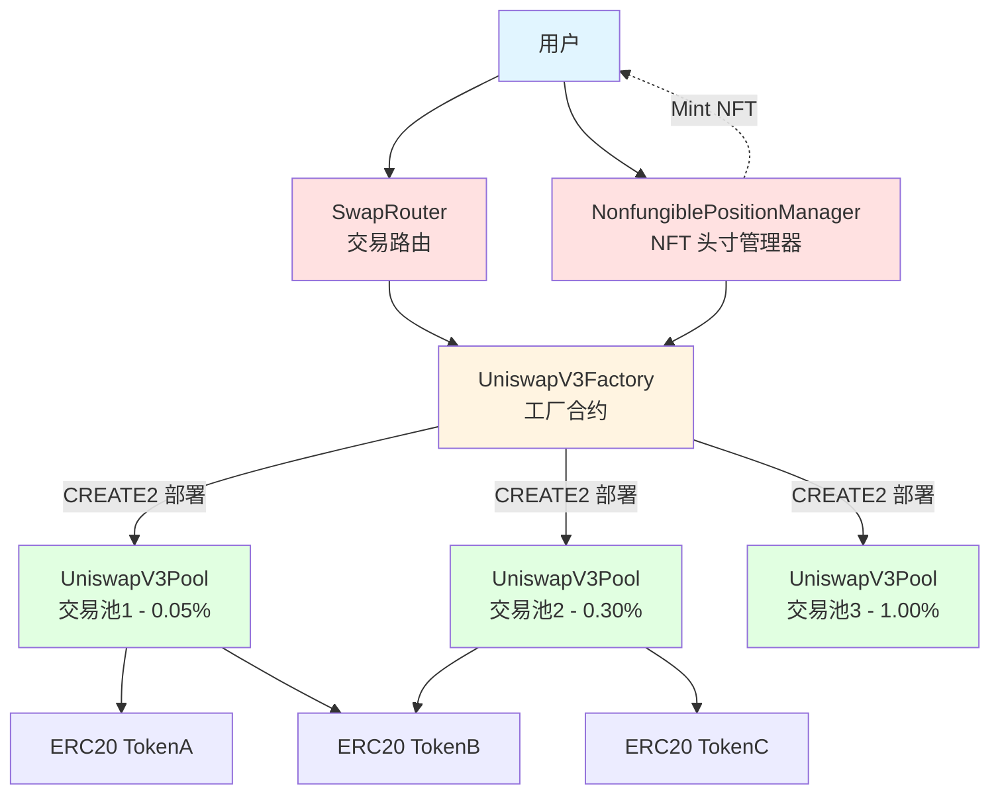
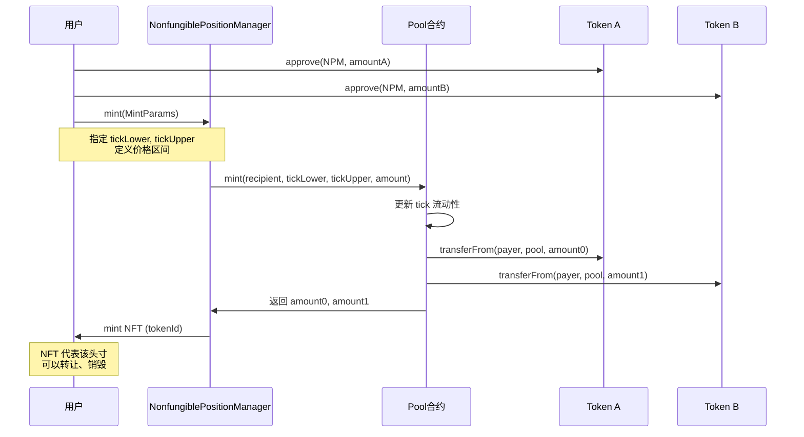
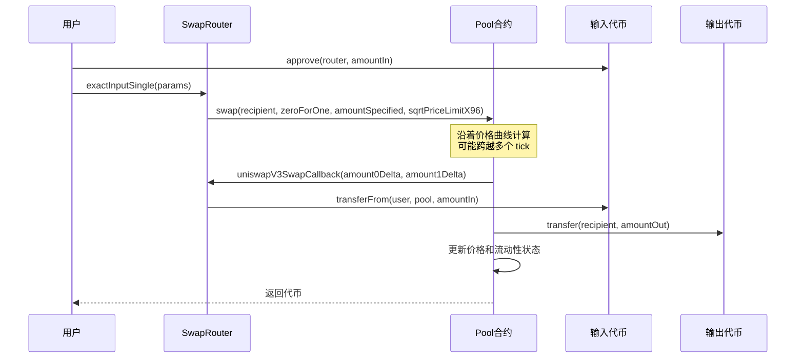
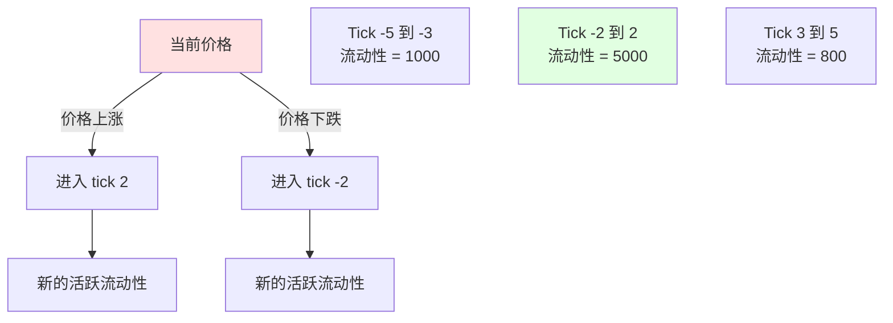

# Uniswap V3 本地部署项目

这是一个用于学习和本地部署 Uniswap V3 的 Foundry 项目，包含完整的核心和周边合约，并添加了详细的中文注释。

## 🎯 Uniswap V3 核心创新

### 与 V2 的主要区别

| 特性 | Uniswap V2 | Uniswap V3 |
|------|------------|------------|
| 流动性分布 | 均匀分布在 (0, ∞) | 集中流动性，LP 可选择价格区间 |
| 手续费等级 | 固定 0.3% | 0.05%, 0.30%, 1.00% 三档可选 |
| 资本效率 | 较低 | 可提升 4000 倍以上 |
| LP 代币 | ERC20（可替代） | ERC721 NFT（不可替代） |
| 价格预言机 | TWAP | 改进的几何 TWAP，gas 优化 |
| Range Orders | 不支持 | 支持（限价单功能） |

### 集中流动性（Concentrated Liquidity）

```mermaid
graph LR
    A[价格区间选择] --> B[Pa: 下限价格]
    A --> C[Pb: 上限价格]
    B --> D[实际流动性 = L / sqrt(Pa)]
    C --> E[实际流动性 = L * sqrt(Pb)]
    D --> F[资本效率提升]
    E --> F

    style A fill:#e1f5ff
    style F fill:#e1ffe1
```

LP 可以选择在特定价格区间提供流动性，从而：
- **提高资本效率**：相同的资金，更高的深度
- **灵活策略**：看好某个价格范围时集中资金
- **定制化风险**：控制无常损失范围

## 🏗️ 架构图

### Uniswap V3 整体架构



### 添加流动性流程



### Tick 与价格关系

```mermaid
graph LR
    A[Tick Index] -->|tick = log₁.₀₀₀₁(price)| B[Price]
    B -->|price = 1.0001^tick| A

    C[Tick Spacing] -->|每个 fee tier 固定| D[可用的 tick]

    E[例子: tick = 0] --> F[price = 1]
    G[例子: tick = 6932] --> H[price ≈ 2]
    I[例子: tick = -6932] --> J[price ≈ 0.5]

    style A fill:#e1f5ff
    style B fill:#ffe1e1
    style D fill:#e1ffe1
```

### 交换流程



### 集中流动性可视化



## 📁 项目结构

```
uniswap-v3-deploy/
├── src/
│   ├── core/                   # Uniswap V3 核心合约
│   │   ├── UniswapV3Factory.sol     # 工厂合约 - 创建交易池
│   │   ├── UniswapV3Pool.sol        # 交易池合约 - 集中流动性 AMM
│   │   ├── UniswapV3PoolDeployer.sol # 池部署器
│   │   ├── NoDelegateCall.sol       # 防止 delegatecall 的基类
│   │   ├── interfaces/              # 接口文件
│   │   └── libraries/               # 核心库（Tick, Position, Oracle 等）
│   │
│   ├── periphery/              # Uniswap V3 周边合约
│   │   ├── SwapRouter.sol           # 交易路由
│   │   ├── NonfungiblePositionManager.sol  # NFT 头寸管理
│   │   ├── NonfungibleTokenPositionDescriptor.sol  # NFT 元数据
│   │   ├── V3Migrator.sol           # V2 迁移工具
│   │   ├── base/                    # 基础合约
│   │   ├── interfaces/              # 接口文件
│   │   ├── libraries/               # 工具库
│   │   └── lens/                    # 链上查询合约（Quoter 等）
│   │
│   └── test-tokens/            # 测试代币
│       ├── WETH9.sol               # Wrapped Ether
│       └── MockERC20.sol           # 通用 ERC20 测试代币
│
├── script/                     # 部署脚本
│   ├── Deploy.s.sol                # 完整部署脚本
│   └── CalculateInitCodeHash.s.sol # 计算 init_code_hash 工具
│
├── test/                       # 测试文件
│   └── UniswapV3.t.sol             # 完整功能测试
│
├── v3-core/                    # Uniswap V3 核心原始仓库
├── v3-periphery/               # Uniswap V3 周边原始仓库
└── foundry.toml                # Foundry 配置
```

## 🎯 核心概念

### 1. 集中流动性 (Concentrated Liquidity)

与 V2 的恒定乘积公式不同，V3 允许 LP 在特定价格区间内提供流动性：

```
x * y = L²  （在价格区间 [Pa, Pb] 内）
```

**优势**：
- LP 可以选择最活跃的价格范围
- 相同资金获得更高的费用收益
- 资本效率最高可提升 4000 倍

**风险**：
- 价格脱离区间后，流动性不活跃
- 需要更主动的管理策略

### 2. Tick 系统

价格被离散化为 tick：
```
price = 1.0001^tick
```

- **Tick Spacing**：每个 fee tier 有固定的 tick 间隔
  - 0.05% fee → tick spacing = 10
  - 0.30% fee → tick spacing = 60
  - 1.00% fee → tick spacing = 200

- **流动性只能在符合 spacing 的 tick 上添加**

### 3. Position（头寸）

每个 LP 头寸包含：
- `tickLower`: 价格下限（tick index）
- `tickUpper`: 价格上限（tick index）
- `liquidity`: 提供的流动性数量
- `feeGrowthInside`: 该区间内累积的费用

头寸以 NFT (ERC721) 形式表示，不可互换。

### 4. 多级手续费

V3 支持三种费用等级：
- **0.05%**：稳定币对（如 DAI/USDC）
- **0.30%**：主流代币对（如 ETH/DAI）
- **1.00%**：高风险或低流动性代币对

同一代币对可以有多个池，每个池不同费率。

### 5. 范围订单 (Range Orders)

通过将流动性集中在极窄的价格区间，可以实现限价单功能：

```
例：在 $2000-$2001 提供 ETH 流动性
→ 当价格达到该区间时自动卖出
→ 类似于限价卖单
```

### 6. 改进的价格预言机

- **几何平均 TWAP**：更准确的时间加权平均价格
- **更低 gas 成本**：每个池只需在每个区块第一次交易时更新
- **更长的历史数据**：存储更多价格点

### 7. 闪电贷 (Flash Swaps)

V3 继承了 V2 的闪电贷功能，允许：
- 先借出代币
- 在回调函数中执行任意操作
- 最后归还代币 + 手续费

## 🚀 部署流程

### 前置要求

```bash
# 安装 Foundry
curl -L https://foundry.paradigm.xyz | bash
foundryup

# 验证安装
forge --version
```

### 编译合约

```bash
forge build
```

### 本地部署

1. 启动本地节点：
   ```bash
   anvil
   ```

2. 部署合约：
   ```bash
   forge script script/Deploy.s.sol --fork-url http://localhost:8545 --broadcast
   ```

### 手动部署步骤

1. **部署测试代币**
   ```solidity
   WETH9 weth = new WETH9();
   MockERC20 dai = new MockERC20("Dai", "DAI");
   MockERC20 usdc = new MockERC20("USDC", "USDC");
   ```

2. **部署 UniswapV3Factory**
   ```solidity
   factory = new UniswapV3Factory();
   ```

3. **部署 NonfungiblePositionManager**
   ```solidity
   nftPositionManager = new NonfungiblePositionManager(
       address(factory),
       address(weth),
       address(nftDescriptor)
   );
   ```

4. **部署 SwapRouter**
   ```solidity
   swapRouter = new SwapRouter(address(factory), address(weth));
   ```

5. **创建交易池**
   ```solidity
   // 创建 DAI/USDC 池，0.05% 费率
   factory.createPool(address(dai), address(usdc), 500);

   // 初始化价格 (sqrtPriceX96)
   pool.initialize(sqrtPriceX96);
   ```

6. **添加流动性**
   ```solidity
   INonfungiblePositionManager.MintParams memory params =
       INonfungiblePositionManager.MintParams({
           token0: address(dai),
           token1: address(usdc),
           fee: 500,
           tickLower: -887220,  // 价格下限对应的 tick
           tickUpper: 887220,   // 价格上限对应的 tick
           amount0Desired: 10000 * 10**18,
           amount1Desired: 10000 * 10**6,
           amount0Min: 0,
           amount1Min: 0,
           recipient: msg.sender,
           deadline: block.timestamp + 300
       });

   nftPositionManager.mint(params);
   ```

## 🧪 测试

运行测试：

```bash
forge test -vvv
```

测试覆盖：
- ✅ 创建交易池（多个 fee tier）
- ✅ 添加/移除流动性（集中流动性）
- ✅ 单跳和多跳交换
- ✅ 价格跨越多个 tick
- ✅ 闪电贷
- ✅ 费用收集
- ✅ NFT 头寸管理
- ✅ 价格预言机

## 📚 合约详解

### UniswapV3Factory

**职责**：创建和管理交易池

**关键功能**：
- `createPool(token0, token1, fee)`: 创建新池
- `enableFeeAmount(fee, tickSpacing)`: 启用新的费用等级
- `setOwner()`: 更改所有者

**特点**：
- 使用 CREATE2 部署，地址可预测
- 同一代币对可以有多个池（不同费率）
- 只有 owner 能启用新费率

### UniswapV3Pool

**职责**：实现集中流动性 AMM 核心逻辑

**关键功能**：
- `initialize(sqrtPriceX96)`: 初始化池子价格
- `mint(recipient, tickLower, tickUpper, amount)`: 添加流动性
- `burn(tickLower, tickUpper, amount)`: 移除流动性
- `swap(recipient, zeroForOne, amountSpecified, sqrtPriceLimitX96, data)`: 执行交换
- `collect(recipient, tickLower, tickUpper, amount0, amount1)`: 收集费用
- `flash(recipient, amount0, amount1, data)`: 闪电贷

**重要状态**：
- `slot0`: 当前价格、tick、观察索引等
- `liquidity`: 当前活跃流动性
- `ticks`: tick 级别的流动性信息
- `positions`: 头寸信息（流动性、费用）

### NonfungiblePositionManager

**职责**：管理 LP 头寸（NFT 形式）

**关键功能**：
- `mint(MintParams)`: 创建新头寸，铸造 NFT
- `increaseLiquidity(IncreaseLiquidityParams)`: 增加流动性
- `decreaseLiquidity(DecreaseLiquidityParams)`: 减少流动性
- `collect(CollectParams)`: 收取费用
- `burn(tokenId)`: 销毁空头寸

**特点**：
- 每个头寸是一个唯一的 NFT (ERC721)
- NFT 可以转让，代表头寸所有权
- 支持 permit 签名授权

### SwapRouter

**职责**：用户交易的便捷接口

**关键功能**：
- `exactInputSingle(ExactInputSingleParams)`: 单池精确输入交换
- `exactInput(ExactInputParams)`: 多跳精确输入交换
- `exactOutputSingle(ExactOutputSingleParams)`: 单池精确输出交换
- `exactOutput(ExactOutputParams)`: 多跳精确输出交换

**安全特性**：
- Deadline 保护
- 滑点保护（amountOutMinimum / amountInMaximum）
- 原子操作

## 🔍 代码学习要点

### 1. 集中流动性计算

查看 `UniswapV3Pool.sol` 的 `mint()` 函数：

```solidity
// 计算需要的代币数量
amount0 = SqrtPriceMath.getAmount0Delta(
    slot0.sqrtPriceX96,
    TickMath.getSqrtRatioAtTick(tickUpper),
    liquidity.toInt128()
);

amount1 = SqrtPriceMath.getAmount1Delta(
    TickMath.getSqrtRatioAtTick(tickLower),
    slot0.sqrtPriceX96,
    liquidity.toInt128()
);
```

### 2. Tick 跨越逻辑

交换时可能跨越多个 tick，每个 tick 的流动性不同：

```solidity
// 当价格跨越 tick 时
if (state.tick != step.tickNext) {
    if (step.initialized) {
        int128 liquidityNet = ticks.cross(
            step.tickNext,
            feeGrowthGlobal0X128,
            feeGrowthGlobal1X128
        );

        // 更新活跃流动性
        if (zeroForOne) liquidityNet = -liquidityNet;
        state.liquidity = liquidityNet < 0
            ? state.liquidity - uint128(-liquidityNet)
            : state.liquidity + uint128(liquidityNet);
    }

    state.tick = zeroForOne ? step.tickNext - 1 : step.tickNext;
}
```

### 3. 费用累积

费用以全局费用增长率的形式累积：

```solidity
// 每次交换后更新全局费用
feeGrowthGlobal0X128 += FullMath.mulDiv(
    fees,
    FixedPoint128.Q128,
    liquidity
);
```

LP 的费用 = (全局费用增长 - 头寸创建时的费用增长) * 流动性

### 4. 价格-tick 转换

```solidity
// Tick to Price
function getSqrtRatioAtTick(int24 tick)
    internal pure returns (uint160 sqrtPriceX96)
{
    uint256 absTick = tick < 0 ? uint256(-int256(tick)) : uint256(int256(tick));
    require(absTick <= uint256(MAX_TICK), 'T');

    // 使用预计算的常数进行快速计算
    uint256 ratio = absTick & 0x1 != 0
        ? 0xfffcb933bd6fad37aa2d162d1a594001
        : 0x100000000000000000000000000000000;
    // ... 更多位运算优化
}
```

## ⚠️ 重要注意事项

### 1. Gas 优化

V3 的 gas 成本比 V2 高，特别是：
- 跨越多个 tick 的交换
- 复杂的流动性头寸管理

### 2. 价格滑点

集中流动性可能导致：
- 区间内滑点很小
- 跨越区间边界时滑点突然增大

### 3. 无常损失

集中流动性会：
- 放大无常损失风险
- 价格离开区间后收益归零

### 4. Tick Spacing

不同费率的 tick spacing 不同，影响：
- 可选择的价格精度
- Gas 成本
- 流动性碎片化程度

## 📖 学习资源

- [Uniswap V3 白皮书](https://uniswap.org/whitepaper-v3.pdf)
- [Uniswap V3 官方文档](https://docs.uniswap.org/contracts/v3/overview)
- [Uniswap V3 源码仓库 - Core](https://github.com/Uniswap/v3-core)
- [Uniswap V3 源码仓库 - Periphery](https://github.com/Uniswap/v3-periphery)
- [Uniswap V3 开发书](https://uniswapv3book.com/)
- [Paradigm: Understanding Uniswap V3](https://www.paradigm.xyz/2021/06/uniswap-v3-the-universal-amm)

## 🤝 贡献

欢迎提交 Issue 和 Pull Request！

## 📄 许可证

MIT License
